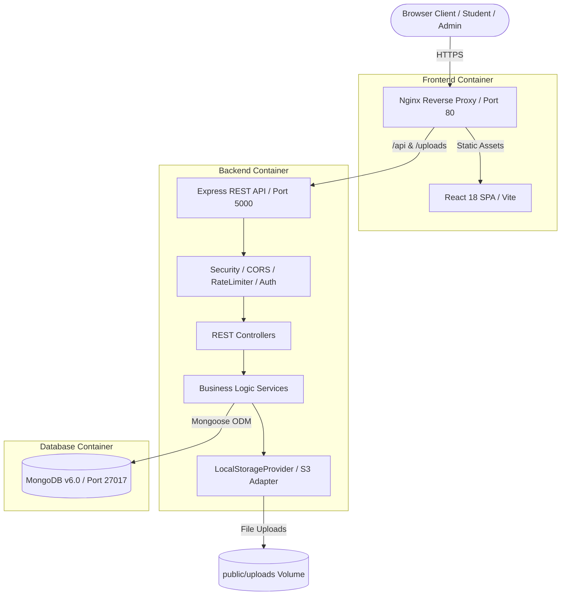
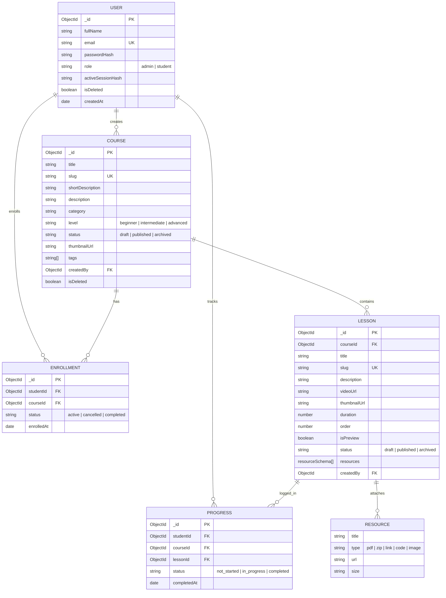

# 🎓 SkillMatrix - Enterprise Learning Management System (LMS)

[](CHANGELOG.md)
[](.github/workflows/ci.yml)
[](https://nodejs.org/)
[](https://react.dev/)
[](https://www.mongodb.com/)
[](LICENSE)

SkillMatrix is an enterprise-grade, high-performance Learning Management System (LMS) built with **React, Vite, Node.js, Express, and MongoDB**. It features dual-token JWT authentication, Role-Based Access Control (RBAC), interactive video lesson playback, real-time progress calculations, Admin analytics dashboards, full-text search & recommendation discovery algorithms, storage provider abstraction, multi-stage Docker containerization, and GitHub Actions CI/CD automation.

---

## 🚀 Key Feature Modules

### 🔐 1. Authentication & Security Hardening
- **Dual JWT Token Architecture**: Access Tokens (Authorization header) + Rotated Refresh Tokens (HttpOnly cookies).
- **Session Revocation**: `activeSessionHash` tracking enables instant global logouts and session termination.
- **RBAC Guards**: Role-based access boundaries enforcing `Admin` vs `Student` route policies.
- **Security Headers**: Helmet CSP (Content Security Policy), CORS origin enforcement, rate limiters (`authLimiter`), and Mongo injection sanitization.

### 📚 2. Course & Lesson Management
- **Course Lifecycle**: Scaffold draft courses, edit metadata, filter by level (`Beginner`, `Intermediate`, `Advanced`), upload thumbnail assets, publish, or archive.
- **Interactive Lesson Player**: Video playback supporting YouTube, Vimeo, and direct MP4 streams.
- **Syllabus & Ordering**: Sequential lesson ordering, manual drag/reordering, and free guest preview support.
- **Resource Attachments**: Direct PDF, ZIP, TXT, and image resource file uploads with storage adapter abstraction.

### 🎓 3. Enrollment & Progress Tracking
- **Course Enrollments**: Student self-enrollment with duplicate record prevention.
- **Real-Time Progress Tracking**: Calculates course completion percentages based on completed lessons (`not_started`, `in_progress`, `completed`).
- **Student My Learning Portal**: Continue Learning hero banner, active enrolled courses list, and progress indicators.

### 📊 4. Admin Analytics Dashboard
- **Real-Time KPI Cards**: Total Students, Active Courses, Total Enrollments, and Platform Completion Rate.
- **Top Enrolled Courses**: Ranking by student volume and completion rates.
- **Recent Activity Feed**: Real-time event timeline of student registrations, course enrollments, and lesson completions.

### 🔍 5. Search, Discovery & UX
- **Full-Text & Compound Indexing**: Optimized search across course titles, short descriptions, and tags.
- **Multi-Attribute Filters & Sorting**: Category, level, tags, and sorting by `newest`, `oldest`, `most_enrolled`, `highest_completion`.
- **Recommendation Algorithms**: Popular trending courses and personalized recommendations based on student learning categories.

### 🐳 6. Dockerization & CI/CD Operations
- **Container Orchestration**: `docker-compose.yml` orchestrating `frontend` (Nginx Alpine), `backend` (Node 18 Alpine), and `mongodb` with persistent named volumes.
- **Health Monitoring**: `GET /health` monitoring endpoint and `SIGTERM`/`SIGINT` graceful shutdown handlers.
- **CI/CD Pipeline**: GitHub Actions workflow (`.github/workflows/ci.yml`) automating ESLint checks, client production build, and 74 Vitest integration tests.

---

## 🏗️ System Architecture Diagram



---

## 🗄️ Database Entity-Relationship (ER) Diagram



---

## 📖 API Documentation Reference

SkillMatrix provides complete **OpenAPI 3.0** documentation. See [openapi.yaml](docs/openapi.yaml) for full schema definitions and request/response examples.

| Method | Endpoint | Description | Auth Required |
| :--- | :--- | :--- | :--- |
| `GET` | `/health` | Application & database health status | None |
| `POST` | `/api/auth/register` | Register a new student account | None |
| `POST` | `/api/auth/login` | Authenticate user & issue JWT tokens | None |
| `POST` | `/api/auth/refresh` | Rotate access token via HttpOnly refresh cookie | Cookie |
| `POST` | `/api/auth/logout` | Revoke session & clear cookies | Bearer JWT |
| `GET` | `/api/auth/me` | Fetch authenticated user profile | Bearer JWT |
| `GET` | `/api/courses` | List published courses with search, filters & pagination | Optional |
| `POST` | `/api/courses` | Create draft course | Admin |
| `GET` | `/api/courses/popular` | Fetch top enrolled popular courses | Optional |
| `GET` | `/api/courses/recommended` | Fetch personalized course recommendations | Student |
| `GET` | `/api/courses/recent-learning` | Fetch student continue learning status | Student |
| `GET` | `/api/courses/:slug` | Fetch single course details by slug or ID | Optional |
| `POST` | `/api/courses/:courseId/enroll` | Enroll student in published course | Student |
| `GET` | `/api/courses/:courseId/lessons` | List course lessons syllabus | Optional |
| `POST` | `/api/lessons/:lessonId/progress` | Update lesson progress & completion | Student |
| `GET` | `/api/admin/dashboard` | Real-time Admin analytics overview | Admin |
| `POST` | `/api/uploads/image` | Upload thumbnail image | Admin |
| `POST` | `/api/uploads/resource` | Upload PDF/ZIP resource file | Admin |

---

## 📁 Repository Folder Structure

```
SkillMatrix/
 ├── .github/
 │   └── workflows/
 │       └── ci.yml               # GitHub Actions CI/CD pipeline
 ├── client/                      # React Frontend Single Page Application
 │   ├── src/
 │   │   ├── components/          # Reusable UI components (FilterBar, FileUpload, ImagePreview, etc.)
 │   │   ├── constants/           # System routing paths and constants
 │   │   ├── context/             # Auth, Theme, and Toast React Context providers
 │   │   ├── hooks/               # Custom React hooks
 │   │   ├── layouts/             # Shared, Admin, Student, and Auth layouts
 │   │   ├── pages/               # Container pages (CourseCatalog, LessonPlayer, MyLearning, AdminDashboard)
 │   │   ├── routes/              # App routes, lazy loading, and security guards
 │   │   └── services/            # Axios API service bindings
 │   ├── Dockerfile               # Multi-stage Nginx client Dockerfile
 │   ├── nginx.conf               # Nginx reverse proxy configuration
 │   └── package.json
 ├── server/                      # Node.js & Express REST API Backend
 │   ├── src/
 │   │   ├── config/              # Environment schema validation
 │   │   ├── constants/           # Domain enums & HTTP constants
 │   │   ├── controllers/         # Thin REST API controllers
 │   │   ├── database/            # Mongoose connection & retry strategy
 │   │   ├── errors/              # Operational error classes
 │   │   ├── logger/              # Structured Pino logging
 │   │   ├── middlewares/         # Auth, security, rate-limiting, error handlers
 │   │   ├── models/              # Mongoose database models (User, Course, Lesson, Enrollment, Progress)
 │   │   ├── routes/              # Express API routers
 │   │   ├── services/            # Core business logic services
 │   │   ├── tests/               # Vitest integration test suite (74 passing tests)
 │   │   └── validators/          # Zod validation schemas
 │   ├── public/uploads/          # Local media storage directory
 │   ├── Dockerfile               # Multi-stage Node Alpine Dockerfile
 │   ├── server.js                # Server entry point & graceful shutdown
 │   └── package.json
 ├── docs/                        # Complete technical documentation suite
 │   ├── openapi.yaml             # OpenAPI 3.0 specification
 │   ├── ARCHITECTURE.md          # Architecture guide & patterns
 │   ├── DEPLOYMENT.md            # Production deployment guide
 │   ├── DOCKER_GUIDE.md          # Containerization manual
 │   ├── CICD_GUIDE.md            # CI/CD automation guide
 │   ├── BACKUP_ROLLBACK_GUIDE.md # Backup & rollback strategy
 │   └── RELEASE_CHECKLIST.md     # Pre-release checklist matrix
 ├── docker-compose.yml           # Full-stack container orchestration
 ├── .env.example                 # Root environment template
 ├── CHANGELOG.md                 # Version release history
 ├── README.md                    # System documentation
 └── package.json                 # Workspace dependencies
```

---

## ⚡ Quick Start & Deployment Options

### Option A: One-Command Docker Compose Deployment (Recommended)
```bash
# Clone the repository
git clone https://github.com/Vishnu3568/SkillMatrix.git
cd SkillMatrix

# Start full-stack containers (Frontend, Backend, MongoDB)
docker-compose up -d --build
```
- Access Frontend UI at `http://localhost`
- Access Backend API at `http://localhost:5000`
- Access Health Check at `http://localhost:5000/health`

---

### Option B: Local Node.js Development Setup

1. **Install Dependencies**:
   ```bash
   npm install
   ```

2. **Configure Environment Variables**:
   Copy `.env.example` templates:
   ```bash
   cp .env.example .env
   cp server/.env.example server/.env
   ```

3. **Start Development Servers**:
   ```bash
   npm run dev
   ```

4. **Execute Quality & Test Verification**:
   ```bash
   npm run lint          # Run ESLint quality checks (0 errors)
   npm run build         # Build client production bundle
   npm test              # Run backend Vitest integration suite (74 tests passing)
   ```

---

## 🛠️ Verification & Test Suite Output

```bash
 ✓ src/tests/security.test.js (3 tests)
 ✓ src/tests/media.test.js (6 tests)
 ✓ src/tests/discovery.test.js (8 tests)
 ✓ src/tests/dashboard.test.js (3 tests)
 ✓ src/tests/progress.test.js (6 tests)
 ✓ src/tests/enrollment.test.js (14 tests)
 ✓ src/tests/lesson.test.js (9 tests)
 ✓ src/tests/course.test.js (13 tests)
 ✓ src/tests/auth.test.js (12 tests)

 Test Files  9 passed (9)
      Tests  74 passed (74)
   Duration  4.52s
```

---

## 📄 License

SkillMatrix is open-source software licensed under the [MIT License](LICENSE).
