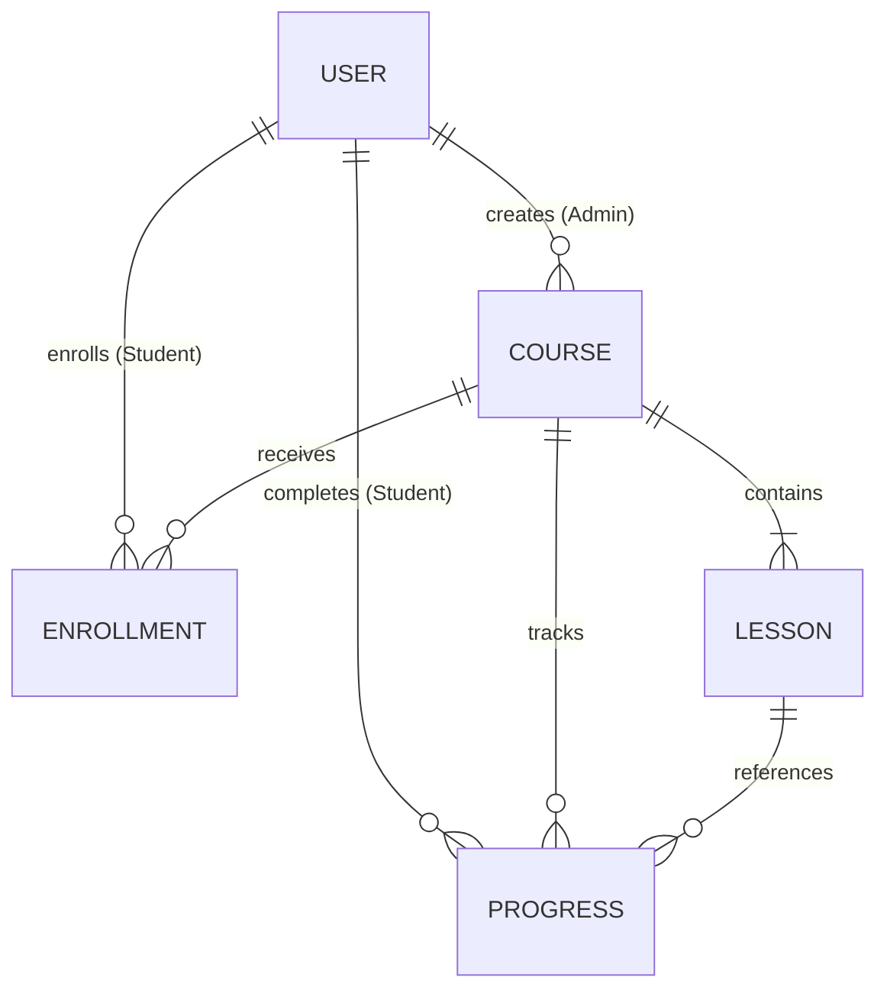

# MongoDB Database Design

This document details the database schema, field definitions, indexes, validations, and relationships for **SkillMatrix** using MongoDB and Mongoose.

---

## Data Schema Relationships

---

## 1. User Collection

### Purpose
Stores account credentials, profile information, and role definitions for both Admins and Students.

### Fields
| Field Name | Type | Constraints / Validation | Description |
| :--- | :--- | :--- | :--- |
| `_id` | ObjectId | Auto-generated | Unique identifier. |
| `name` | String | Required, trimmed, max 100 chars | User's full name. |
| `email` | String | Required, unique, trimmed, lowercase, regex: email | Primary contact and login identifier. |
| `password` | String | Required, min 6 chars | Hashed password string. |
| `role` | String | Required, enum: `["admin", "student"]`, default: `"student"` | Role determining authorization level. |
| `createdAt` | Date | Auto-generated | Account registration timestamp. |
| `updatedAt` | Date | Auto-generated | Last account modification timestamp. |

### Indexes
- **Primary Unique Index**: `{ email: 1 }` (Ensures no two users register with the same email. Optimizes user lookup on login).

### Mongoose Validation Rules
- **Email Regex**: `/^[^\s@]+@[^\s@]+\.[^\s@]+$/`
- **Password**: Hashed using `bcrypt` (10 rounds) before saving via the `pre("save")` Mongoose hook.

---

## 2. Course Collection

### Purpose
Contains course metadata, descriptions, cover thumbnails, and status settings created and updated by Admins.

### Fields
| Field Name | Type | Constraints / Validation | Description |
| :--- | :--- | :--- | :--- |
| `_id` | ObjectId | Auto-generated | Unique identifier. |
| `title` | String | Required, trimmed, min 5, max 150 chars | Course title. |
| `description` | String | Required, min 10 chars | Detailed course syllabus description. |
| `thumbnailUrl` | String | Optional, valid HTTP/HTTPS URL | URL to the course cover image. |
| `status` | String | Required, enum: `["draft", "published"]`, default: `"draft"` | Access status. Published makes it visible to students. |
| `createdBy` | ObjectId | Required, Ref: `User` | References the Admin who created the course. |
| `createdAt` | Date | Auto-generated | Course creation timestamp. |
| `updatedAt` | Date | Auto-generated | Last modification timestamp. |

### Relationships
- **Created By**: Belongs to `User` (Admin) (1-to-Many: User -> Course).
- **Lessons**: Associated with many `Lesson` documents (1-to-Many: Course -> Lesson).

### Indexes
- **Catalog Lookup Index**: `{ status: 1, createdAt: -1 }` (Optimizes queries displaying newly published courses to students).
- **Search Index**: Text index on `{ title: "text", description: "text" }` (Enables efficient word-matching and fuzzy searches for course discovery).

---

## 3. Lesson Collection

### Purpose
Defines instructional content files and resources within a course, incorporating video stream references and course progression ordering.

### Fields
| Field Name | Type | Constraints / Validation | Description |
| :--- | :--- | :--- | :--- |
| `_id` | ObjectId | Auto-generated | Unique identifier. |
| `courseId` | ObjectId | Required, Ref: `Course` | References the parent course. |
| `title` | String | Required, trimmed, min 3, max 150 chars | Lesson title. |
| `description` | String | Optional | Overview of the lesson content. |
| `videoUrl` | String | Required, valid YouTube, Vimeo, or S3 URL | URL of the instructional video lesson. |
| `order` | Number | Required, min 1, integer | Sequential order position in the course. |
| `createdAt` | Date | Auto-generated | Record creation timestamp. |
| `updatedAt` | Date | Auto-generated | Last update timestamp. |

### Relationships
- **Parent Course**: Belongs to `Course` (Many-to-1: Lesson -> Course).

### Indexes
- **Ordering Index**: `{ courseId: 1, order: 1 }` (Unique compound index. Ensures lessons are queried sequentially and prevents double-allocating order slots within a single course).

### Validation Rules
- **Video URL Pattern**: Validates via regex matching standard streaming domains (YouTube, Vimeo, or CDN URL structures).

---

## 4. Enrollment Collection

### Purpose
Represents student enrollments in courses, decoupling user profiles from course materials and storing completion metrics.

### Fields
| Field Name | Type | Constraints / Validation | Description |
| :--- | :--- | :--- | :--- |
| `_id` | ObjectId | Auto-generated | Unique identifier. |
| `studentId` | ObjectId | Required, Ref: `User` | References the enrolled student user. |
| `courseId` | ObjectId | Required, Ref: `Course` | References the enrolled course. |
| `enrolledAt` | Date | Auto-generated, default: `Date.now` | Date student enrolled in the course. |
| `completedAt` | Date | Optional | Date student completed all lessons in the course. |

### Relationships
- **Student Reference**: Belongs to `User` (Student) (Many-to-1).
- **Course Reference**: Belongs to `Course` (Many-to-1).

### Indexes
- **Enrollment Lock Index**: `{ studentId: 1, courseId: 1 }` (Unique compound index. Prevents a student from enrolling in the same course multiple times).
- **Course Enrollments Index**: `{ courseId: 1 }` (Used by Admins to count student enrollments for reports).

---

## 5. Progress Collection

### Purpose
Tracks individual student completion status of specific lessons inside their enrolled courses.

### Fields
| Field Name | Type | Constraints / Validation | Description |
| :--- | :--- | :--- | :--- |
| `_id` | ObjectId | Auto-generated | Unique identifier. |
| `studentId` | ObjectId | Required, Ref: `User` | References the student. |
| `courseId` | ObjectId | Required, Ref: `Course` | References the parent course. |
| `lessonId` | ObjectId | Required, Ref: `Lesson` | References the completed lesson. |
| `completed` | Boolean | Required, default: `true` | Completion status of the lesson. |
| `completedAt` | Date | Required, default: `Date.now` | Date the lesson was checked as complete. |

### Relationships
- **Student Reference**: Belongs to `User` (Many-to-1).
- **Course Reference**: Belongs to `Course` (Many-to-1).
- **Lesson Reference**: Belongs to `Lesson` (Many-to-1).

### Indexes
- **Progress Lookup Index**: `{ studentId: 1, courseId: 1, lessonId: 1 }` (Unique compound index. Rapidly checks if a student completed a lesson and blocks duplicate completion records).
- **Course Performance Index**: `{ studentId: 1, courseId: 1 }` (Retrieves all completed lessons for a student in a course to calculate percentage progress).
