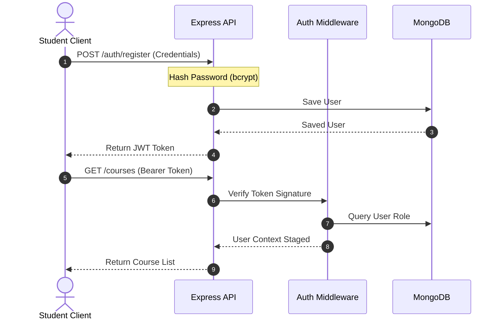

# Security Strategy & Configurations

This document details the security architecture for the **SkillMatrix** platform, covering threat mitigations, verification mechanisms, and defensive coding configurations.

---

## 1. Authentication Flow & JWT Lifecycle

### Hashing Strategy
All user passwords must be hashed using the **bcrypt** algorithm with a work factor (salt rounds) of `10`. Cleartext passwords must never be stored in the database or written to execution log files.



### JWT Lifecycle & Token Strategy
- **Token Generation**: Upon successful login or registration, the backend signs a JSON Web Token (JWT) containing the payload `{ id: user._id, role: user.role }`.
- **Token Signatures**: Signed using `HMAC SHA-256` keys defined in environment variables.
- **Expiration Policy**: Tokens expire after `24 hours` (or shorter if an access/refresh token pair is introduced).
- **Token Storage Strategy**:
  - **Client Storage**: To protect against Cross-Site Scripting (XSS) and Cross-Site Request Forgery (CSRF), tokens are stored by the client application in **HttpOnly, Secure, and SameSite=Strict cookies**.
  - If headers are preferred for mobile/cross-domain integration, tokens are sent via the `Authorization: Bearer <token>` header, with short lifetimes.

---

## 2. Middlewares & Access Controls

### Authentication Middleware (`requireAuth`)
Intercepts incoming requests to protected routes, parses the cookies or Authorization header, validates the signature, and attaches the user payload to `req.user`. If missing or invalid, it returns `401 Unauthorized`.

### Authorization Middleware (`requireRole(...allowedRoles)`)
Restricts access to routes based on user roles. Runs after `requireAuth`. If the user's role is not in the `allowedRoles` list (e.g. Student attempting to access `/api/v1/admin`), it aborts execution and returns `403 Forbidden`.

```javascript
// Example Midleware Interface (Conceptual)
const requireRole = (...roles) => {
  return (req, res, next) => {
    if (!req.user || !roles.includes(req.user.role)) {
      return res.status(403).json({
        success: false,
        error: { code: "FORBIDDEN", message: "Access denied." }
      });
    }
    next();
  };
};
```

---

## 3. API & Middleware Hardening

### HTTP Header Security (Helmet)
Uses the `helmet` package to automatically inject secure HTTP headers, disabling information disclosure (like `X-Powered-By: Express`) and configuring:
- `Content-Security-Policy` (CSP)
- `X-Frame-Options` (Prevents clickjacking)
- `Strict-Transport-Security` (Forces HTTPS)
- `X-Content-Type-Options` (Prevents MIME sniffing)

### Cross-Origin Resource Sharing (CORS)
Restricts client access to the API server. CORS is configured to only allow white-listed production domains:
```javascript
const corsOptions = {
  origin: process.env.CLIENT_ORIGIN_URL || 'http://localhost:5173',
  credentials: true, // Allows HttpOnly cookies to pass
  methods: ['GET', 'POST', 'PATCH', 'DELETE', 'OPTIONS'],
  allowedHeaders: ['Content-Type', 'Authorization']
};
```

### Rate Limiting
Prevents Denial of Service (DoS) and brute-force authentication attempts by applying the `express-rate-limit` middleware:
- **Global API Rate Limit**: Maximum `100` requests per `15 minutes` per IP address.
- **Auth Endpoint Rate Limit** (Register/Login): Maximum `10` requests per `15 minutes` per IP address.

---

## 4. Input Validation & Injection Mitigation

### MongoDB Injection Protection
MongoDB query injection attacks (e.g., passing `{ "$gt": "" }` to bypass login checks) are prevented by:
- **Mongoose Schemas**: Strict schema casting prevents structural database queries from containing unexpected operational characters.
- **Sanitization Middleware**: Running `express-mongo-sanitize` on all incoming requests to strip out keys beginning with `$` or containing `.`.

### Validation & Sanitization Layer
- All input bodies undergo runtime parsing using **Joi** schemas before reaching controllers.
- String fields are trimmed and sanitized (e.g., using `dompurify` or custom regexes where HTML strings are disallowed) to prevent XSS payloads.

---

## 5. Deployment & Error Defense

### Environment Variable Management
All secrets (database URIs, JWT secret tokens, external API keys) are loaded at boot time from `.env` files using `dotenv`. A configuration loader validating the existence of mandatory variables prevents the server from booting in an unstable state.

### Secure Error Responses
- **Development**: System errors return full stack traces and debug statements.
- **Production**: Global error handlers intercept errors. Programmatic errors (e.g., validation failures) return clean, customized JSON error messages. Operational/database engine errors return a generic `500 Internal Server Error` message to hide underlying system architecture details and file directories.
