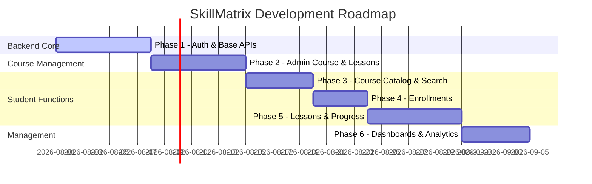

# Dependency Plan, Implementation Roadmap, and Testing Strategy

This document details the software package dependencies, step-by-step development roadmap, testing workflow, and architectural risk mitigation strategies for **SkillMatrix**.

---

## 1. Dependency Planning

To prevent dependency creep and maintain a lightweight production codebase, only critical, production-tested packages are authorized for installation.

### Backend Production Dependencies
- **`express`**: Fast, unopinionated web framework for Node.js routing.
- **`mongoose`**: Strict object modeling and schema casting for MongoDB.
- **`jsonwebtoken`**: Signed token verification for session authentication.
- **`bcryptjs`**: Cryptographic password hashing.
- **`dotenv`**: Environment variable loading from `.env`.
- **`cors`**: Enabling cross-origin API integration.
- **`helmet`**: Secure HTTP header configuration.
- **`express-rate-limit`**: Rate limiting to prevent brute-force attacks.
- **`express-mongo-sanitize`**: Stripping keys starting with `$` to block injection.
- **`joi`**: Declarative schema validation for incoming JSON payloads.

### Frontend Production Dependencies
- **`react` & `react-dom`**: Core client engine.
- **`react-router-dom`**: Frontend SPA routing and path guards.
- **`axios`**: Promise-based HTTP client for API interactions.
- **`lucide-react`**: Lightweight, clean UI icons.

### Development & Build Tools
- **`nodemon`**: Automated node server hot-restarts during development.
- **`vite`**: Ultra-fast build tool and local dev server for React.

### Testing Suite
- **`jest`**: Core testing runner framework.
- **`supertest`**: Declarative HTTP assertion library for API endpoints.
- **`@testing-library/react`**: Component testing with standard DOM query assertions.
- **`cypress`**: End-to-End browser UI automation suite.

---

## 2. Implementation Roadmap

Development follows a dependency-driven sequence where core foundations are verified before building dependent layers.



### Phase Details

#### Phase 1: Authentication & User Module
- **Deliverables**: Database setup, registration/login APIs, security middlewares, and React AuthContext.
- **Dependency Rationale**: The authorization layer is required to protect course administration and student enrollment routes in subsequent phases.

#### Phase 2: Course & Lesson Management (Admin Controls)
- **Deliverables**: Course CRUD, lesson CRUD, and video link inputs.
- **Dependency Rationale**: Courses and lessons must exist before students can browse, search, or enroll.

#### Phase 3: Course Catalog & Search (Student Interface)
- **Deliverables**: Catalog page, course card UI, keyword search APIs, and course details display.
- **Dependency Rationale**: Allows students to discover course listings before they enroll.

#### Phase 4: Enrollment Module
- **Deliverables**: Enrollment creation, student dashboard course cards, and enrollment reporting.
- **Dependency Rationale**: Enrollment registers a student to a course, granting permissions to view lessons.

#### Phase 5: Playback & Progress Tracking
- **Deliverables**: Video player, lesson status listing, mark-complete APIs, and progress calculations.
- **Dependency Rationale**: Progress tracking requires active enrollment references.

#### Phase 6: Reporting & Dashboards
- **Deliverables**: Admin analytics panel and student course history.
- **Dependency Rationale**: Metrics aggregate data generated from courses, enrollments, and progress logs.

---

## 3. Testing Strategy

```
Quality Assurance Model:
[Unit Tests] -> [API/Integration Tests] -> [UI/E2E Tests] -> [Manual/Acceptance]
```

### Unit Testing
- **Backend**: Test utility functions (e.g., JWT signatures) and Joi schema validation rules using Jest.
- **Frontend**: Verify React components and custom hooks (`useAuth`, `useFetch`) render correctly with mock data.

### API Testing
- Test endpoints using `supertest` and Jest. Verify HTTP status codes, error models, and database writes.

### Integration Testing
- Verify system interaction by executing service layer routines against a local MongoDB test instance. Ensure Cascade Deletion removes dependent lessons when a course is deleted.

### UI & E2E Testing
- Run Cypress automation tests to simulate user flows, such as student registration, logging in, searching, enrolling, and completing lessons.

### Manual Verification
- Perform exploratory testing on responsive layouts (mobile, tablet, desktop) and verify video playback.

### Regression & Acceptance Testing
- Implement automated testing in CI/CD pipelines to prevent regressions. Verify code satisfies all acceptance criteria (e.g., verifying a student cannot access another student's progress).

---

## 4. Architectural Risks & Mitigations

### Circular Dependencies
- **Risk**: Tight coupling between routes, controllers, and services leading to boot failure.
- **Mitigation**: Standardize on a strict, unidirectional data flow (Routes -> Controllers -> Services -> Models). Do not import controllers into services or models into routes.

### Duplicate Logic
- **Risk**: Writing the same database queries in controllers and services.
- **Mitigation**: Enforce the rule that controllers *never* import models directly. Controllers only call services. All business queries reside in the Service Layer.

### Data Inconsistency
- **Risk**: Deleting a course while keeping orphan lessons or progress records in the DB.
- **Mitigation**: Use Mongoose pre-remove hooks to run cascade deletes, removing associated lessons, progress logs, and enrollment records.

### Authorization Mistakes
- **Risk**: Students bypassing routes to create or update courses.
- **Mitigation**: Establish route-level permission checks. Verify all admin routes use the `requireRole('admin')` middleware. Run automated API security scans.

### Performance Bottlenecks
- **Risk**: Slow queries when listing courses, searching, or calculating progress.
- **Mitigation**: Apply compound database indexes (e.g., `{ studentId: 1, courseId: 1 }`). Use Mongoose `.select()` to exclude large fields (like description) when listing.

### Scalability Issues
- **Risk**: High concurrent access to video pages slowing down database servers.
- **Mitigation**: Design the backend APIs to be completely stateless. Offload video assets to specialized video CDNs (e.g., YouTube embedded players).
