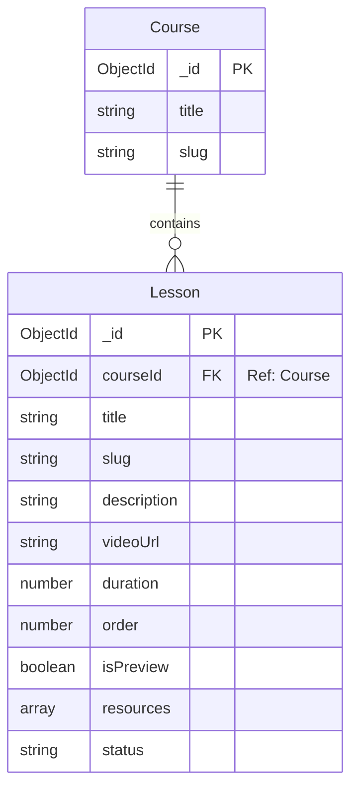

# Phase 5 Database Design Roadmap & Handover

As part of the transition from Phase 4 to Phase 5, the following database architectural recommendation must be implemented for the **Lessons** module.

---

## Lesson Model Architecture

Instead of storing lessons as an embedded array inside the `Course` document (which risks hitting MongoDB's 16MB document size limit as video metadata, descriptions, and resource lists grow), **Lessons must be stored in a separate collection**.

### Collection Name: `lessons`

### Relationship diagram:

### Schema Attributes:
* `_id` (ObjectId)
* `courseId` (ObjectId, ref: 'Course', required): Establishes the parent-child relationship.
* `title` (String, required, trim)
* `slug` (String, lowercase, trim): Unique within the scope of the parent course.
* `description` (String, required)
* `videoUrl` (String, trim): URL link to lesson video resource.
* `duration` (Number, required, min 0): Lesson length in seconds/minutes.
* `order` (Number, required): Positional order index of the lesson within the course syllabus (e.g., 1, 2, 3...).
* `isPreview` (Boolean, default: false): Determines if guests can watch the lesson without enrolling.
* `resources` (Array of Strings, default: []): List of links to code assets, files, or notes.
* `status` (String, enum: `DRAFT`, `PUBLISHED`, default: `DRAFT`)
* `createdAt` / `updatedAt` (Timestamps)

---

## Recommended Database Indexes

To ensure rapid queries and clean constraints, configure the following indexes on the `lessons` collection:

1. **Compound Index for Curriculum Sorting**:
   * `{ courseId: 1, order: 1 }`
   * *Rationale*: Speeds up fetching the structured syllabus list for a specific course page.
2. **Compound Index for Unique Slugs per Course**:
   * `{ courseId: 1, slug: 1 }` (Unique: true)
   * *Rationale*: Prevents duplicate slugs within a single course, while allowing the same slug (e.g. `introduction`) to exist in different courses.
3. **Foreign Key Index**:
   * `{ courseId: 1 }`
   * *Rationale*: Standard index automatically utilized by populate/lookups.
